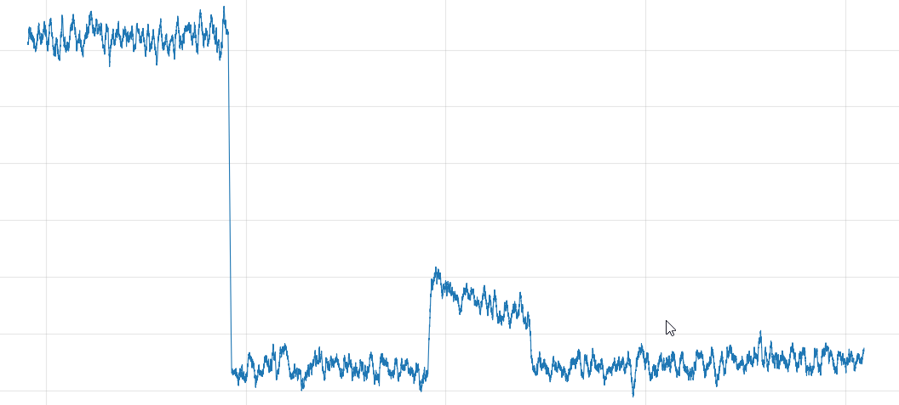

# Data analysis for pulse shaping experiment

## Typical plot

The initial high value of the plot is used to calculate $F_\text{max}$, and then the "peak" later on is used to calculate $F_\text{img}$. The final result, $F_\text{norm}$ is effectively the ratio of these two values, but with the background fluorescence reading accounted for. The background readings are taken with the MOT off, so the measured fluorescence is caused purely by scattering of the MOT beams.

## Mathematical basis
The idea is to calculate the MOT fluorescence recorded while the MOT is being loaded, and then compare this with the MOT fluorescence when the imaging pulse is sent. This can then be used to calculate the "normalised fluorescence": a measure of the population of the MOT in the $\ket{F=2}$ state.

This calculation is done by calculating the fluorescence of the MOT during the loading period, which is done using the formula given in equation 1.
$$F_\text{max} = F_\text{max, act} - F_\text{max, bg} \quad (\text{eq}. \,1)$$
Where $F_\text{h}$ is the fluorescence of the MOT during the loading time, $F_\text{h, act}$ is the actual fluorescence of the MOT at the start, and $F_\text{h, bg}$ is the background measured fluorescence when no MOT is present.

The fluorescence of the MOT during the imaging pulse must also be calculated, using equation 2.
$$F_\text{img} = F_\text{img, act} - F_\text{img, bg} \quad (\text{eq}. \,2)$$
Where (similarly to equation 1) $F_\text{img}$ is the fluorescence of the MOT during the imaging pulse, $F_\text{img, act}$ is the actual fluorescence of the MOT during the imaging pulse, and $F_\text{img, bg}$ is the background measured fluorescence when no MOT is present.

From these two values the normalised fluorescence can be calculated using equation 3.
$$F_\text{norm} = \frac{F_\text{img}}{F_\text{max}} \quad (\text{eq}. \, 3)$$

### Uncertainty calculations

The uncertainty on each background-subtracted fluorescence value is obtained by propagating errors through equations 1 and 2. Since both are subtractions, the uncertainties add in quadrature:
$$\sigma_{F_\text{max}} = \sqrt{\sigma_{F_\text{max, act}}^2 + \sigma_{F_\text{max, bg}}^2} \quad (\text{eq}. \, 4)$$
$$\sigma_{F_\text{img}} = \sqrt{\sigma_{F_\text{img, act}}^2 + \sigma_{F_\text{img, bg}}^2} \quad (\text{eq}. \, 5)$$

The uncertainty on $F_\text{norm}$ is then obtained by propagating errors through equation 3. Since $F_\text{norm}$ is a ratio, the fractional uncertainties add in quadrature:
$$\frac{\sigma_{F_\text{norm}}}{F_\text{norm}} = \sqrt{\left(\frac{\sigma_{F_\text{img}}}{F_\text{img}}\right)^2 + \left(\frac{\sigma_{F_\text{max}}}{F_\text{max}}\right)^2} \quad (\text{eq}. \, 6)$$

Which gives the absolute uncertainty:
$$\sigma_{F_\text{norm}} = F_\text{norm} \sqrt{\left(\frac{\sigma_{F_\text{img}}}{F_\text{img}}\right)^2 + \left(\frac{\sigma_{F_\text{max}}}{F_\text{max}}\right)^2} \quad (\text{eq}. \, 7)$$

For each individual uncertainty $\sigma_{F_\text{max, act}}$, $\sigma_{F_\text{max, bg}}$, etc., the best estimate is the **standard error of the mean**, $\sigma/\sqrt{n}$, computed from repeated measurements. Taking multiple background shots (MOT off) is particularly worthwhile, as it reduces $\sigma_{F_\text{max, bg}}$ and $\sigma_{F_\text{img, bg}}$ and prevents the background subtraction from dominating the total uncertainty.

## Code implementation

Firstly there needs to be a way of running a MOT Fluorescence experiment in background mode. The shot should run as usual but the repumping should be off all the time. As a result the MOT will not be visible as all the population will end up in $\ket{F=1}$. Then in the data analysis, it should require a path to the background as well as a path to the sweep data. Then it should extract the relevant values from the background data: namely $F_\text{bg}$ for both $\text{max}$ and $\text{img}$, and also the uncertainties. It should also extract these values for each of the sweeps (but using the $F_\text{act}$ values rather than the background values). Then once all of these values have been extracted they should be returned so that a separate part of the code can perform the actual data analysis, calculating the value of $F_\text{norm}$ and its uncertainty.